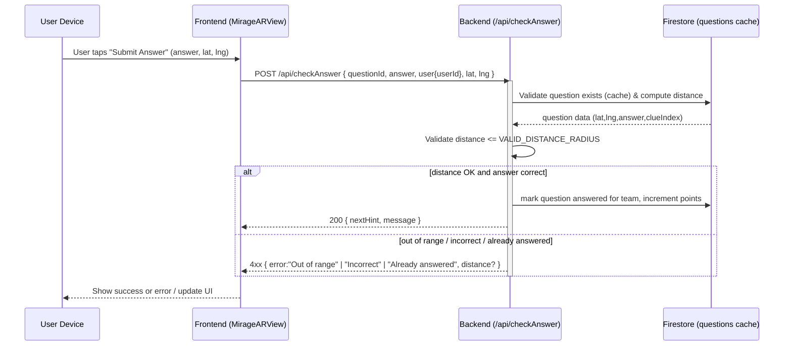

# Mirage-demo — Detailed Maintainer Guide

This README explains the codebase structure, routes, major functions, components, and operational details for maintainers of the Mirage-demo project. The project is split into two main pieces:

- backend — Node.js + TypeScript API (Express) that talks to Firestore (Firebase Admin SDK)
- locar_vite — React + TypeScript frontend (Vite) that provides the AR / game UI

This document covers file layout, what each major file/folder does, endpoints and their behavior, important runtime considerations, how to run locally and in Docker, and suggestions/notes for future work.

Table of contents
- Project layout
- Backend
  - Purpose
  - Key files
  - Routes (endpoints)
  - Important runtime behavior & internals
  - Configuration & environment
  - Docker / running
  - Maintenance notes
- Frontend (locar_vite)
  - Purpose
  - Key files & components
  - Client services (firestoreGeoQuery)
  - App routing
  - Configuration & environment
  - Docker / running
  - Maintenance notes
- Development tips, testing & troubleshooting
- Suggested improvements and TODOs

--------------------------------------------------------------------------------
Project layout (high level)
--------------------------------------------------------------------------------

Root
- backend/           — API server (Express + TypeScript)
  - src/
    - index.ts       — main server file, routes, middlewares, PerfMonitor, cache logic
    - user.ts        — zod schema for user validation / simple user auth shape
    - logger.ts      — logging wrapper (pino or pino-http usage referenced)
    - firebase*      — firebase admin initialization (file(s) not enumerated here but referenced)
    - middlewares/*  — validation middlewares (validate POST body etc.)
    - scripts/       — server scripts used during build/run (copied into Docker image)
  - package.json
  - Dockerfile
  - README.md        — short backend instructions and some "dangerous" scripts notes
- locar_vite/        — frontend (React + TypeScript + Vite)
  - src/
    - main.tsx       — app entry, wraps App in BrowserRouter and AuthProvider
    - App.tsx        — react-router routes mapping
    - index.css
    - components/
      - MirageARView.tsx     — main AR gameplay view
      - MirageARManager.ts   — AR manager (imported from MirageARView)
      - QuestionBox.tsx      — question UI used by MirageARView
      - ErrorBoundary.tsx    — top-level error boundary with UI
      - ProtectedRoute.tsx   — route guard that requires auth
      - Login.tsx            — login flow
      - Leaderboard.tsx      — leaderboard UI
      - LogoutButton.tsx
    - context/
      - AuthContext.tsx      — login state and helpers
    - services/
      - firestoreGeoQuery.ts — location / geo queries, checkAnswer and getLeaderboard client code
    - vite.config.ts
  - package.json
  - Dockerfile
  - nginx.conf (used by frontend Dockerfile)
  - README.md

--------------------------------------------------------------------------------
BACKEND — details
--------------------------------------------------------------------------------

Purpose
- Serve as the latency-sensitive backend for Mirage.
- Provide endpoints for health, logs, cache-refresh, leaderboard, and (implicitly) answer validation / question data retrieval for gameplay.
- Maintain an in-memory questions cache for fast operations and distance checks.

Key files (what to look at)
- backend/src/index.ts
  - Bootstraps Express app.
  - Defines constants (e.g. VALID_DISTANCE_RADIUS = 50 meters).
  - Implements `populateQuestionsCache()` which loads questions from Firestore into memory.
  - Implements `PerfMonitor` class and its middleware used to capture approximate route latencies.
  - Registers routes:
    - GET /                — health-check + perf data
    - GET /logs            — fetch recent or filtered logs
    - GET /api/refreshCache — manual cache refresh (simple userId auth)
    - GET /api/leaderboard — top teams
    - (plus other internal API routes — check the file for additional handlers)
  - Uses middlewares: express.json(), cors(), pino-http logger, custom validatePOSTBody, etc.
  - On startup it populates the questions cache and listens on PORT (default 3000).
- backend/src/user.ts
  - Zod schema for a minimal user object shape; used where lightweight validation is required (e.g. simple auth).
- backend/Dockerfile
  - Multi-stage build: builds TS in builder stage, copies dist to runtime stage; exposes port 3000 and includes a HEALTHCHECK.

Routes and what they do
- GET /
  - Health check endpoint.
  - Returns JSON: { status: "online", ...perf.data } where perf.data is aggregated route timing stats captured by PerfMonitor.
  - Useful for orchestration healthchecks.
- GET /logs
  - Returns recent logs (default most recent 200 entries).
  - Supports `q` query parameter to filter by substring (case-insensitive).
  - Useful for quick debugging/operations.
- GET /api/refreshCache
  - Purpose: refresh in-memory questions cache from Firestore without restarting server.
  - Authentication: currently a simple check that `userId` is present and length === 28 characters (weak).
  - Returns { message: "Cache refreshed successfully", count: <number> } on success.
  - On error returns 500 and logs error.
- GET /api/leaderboard
  - Returns top N teams by points (code queries `mirage-teams` collection, orders by points desc, limit 10).
  - Response: { teams: [{ name, points }, ...] }

Important runtime behavior & internals
- Questions cache:
  - `populateQuestionsCache()` loads all question docs from Firestore into a local array; many code paths rely on this being present and up-to-date.
  - This is used by validation/answer-checking logic to avoid repeated DB hits in latency-sensitive routes.
  - There is an endpoint to refresh the cache when admin adds questions.
- VALID_DISTANCE_RADIUS
  - Backend enforces a proximity radius (50 meters by constant) when considering whether a user is close enough to a Mirage/question.
  - Distance checks are implemented using geolocation math / geohash library (geofire-common).
- PerfMonitor
  - A local class that aggregates route timings per-key and exposes a middleware (perf.middleware("key")) that wraps handlers to capture latency.
  - Useful for lightweight telemetry without external APM tooling.
- Logging
  - pino-http used for request logging; logger wrapper exists (logger import).
  - `getLogs()` exposes reading logs for /logs endpoint.

Security & validation notes
- The backend uses basic validation via zod and custom validate middleware. The user authentication check used in /api/refreshCache is very simple and must be strengthened for production.
- CORS is enabled globally using cors() — review origins allowed in production.
- Firestore access requires Firebase Admin SDK credentials (service account). Ensure secrets are protected and available as environment variables / mounted files.

Configuration & env
- PORT (defaults to 3000)
- Firebase Admin credentials — must be provided per standard Firebase Admin SDK method (service account JSON or environment variables).
- Other internal envs may exist — inspect firebase init code (not enumerated here).

How to run backend locally
- From `backend/`:
  - install: npm ci
  - development run (depending on package.json scripts): npm start or npm run dev (check package.json)
  - ensure Firebase admin credentials are available locally
  - open http://localhost:3000/ for health-check
- Docker:
  - docker build -t mirage-backend:latest -f backend/Dockerfile backend
  - docker run -p 3000:3000 --env-file backend/.env mirage-backend:latest
  - Dockerfile includes a HEALTHCHECK hitting GET /

Maintenance notes
- When adding or changing questions in Firestore, either restart backend or call /api/refreshCache with a valid userId to reload questions into memory.
- The current "simple userId auth" is insecure. Replace with proper Firebase Auth token validation using Admin SDK for admin-only routes.
- Consider adding rate-limiting and stronger validation on all public endpoints.
- Consider persisting recent logs to Cloud Logging / external service for postmortems.

--------------------------------------------------------------------------------
FRONTEND — locar_vite
--------------------------------------------------------------------------------

Purpose
- Single Page App (React + TypeScript) delivered by Vite and packaged into a static site (nginx) in Docker.
- Implements AR view, questions UI, login flow, leaderboard, and client-side location / geo logic.

Key files & components
- locar_vite/src/main.tsx
  - App entrypoint. Wraps <App /> in <BrowserRouter> and <AuthProvider>.
- locar_vite/src/App.tsx
  - Route definitions for the app:
    - /login -> Login component
    - /leaderboard -> Leaderboard component
    - / -> ProtectedRoute -> MirageARView (main gameplay)
  - ErrorBoundary wraps the app for crash-safe UI.
- locar_vite/src/components/MirageARView.tsx
  - Main gameplay view. Integrates MirageARManager (AR logic), shows questions via QuestionBox, and integrates with location services.
  - Detects whether client is mobile/tablet; has UI controls (LogoutButton, QuestionBox, hints).
  - Calls client service functions to query nearby mirages and to submit answers.
- locar_vite/src/components/MirageARManager.ts (imported by MirageARView)
  - Responsible for AR lifecycle, rendering, and possibly mapping the AR overlays; manages detection of nearby Mirage points.
- locar_vite/src/components/QuestionBox.tsx
  - UI for a single question: shows wording, input, hint progression, submit button.
- locar_vite/src/components/ErrorBoundary.tsx
  - React Error Boundary with UI to reload or try again; captures error stacks and displays them in a pre tag.
- locar_vite/src/context/AuthContext.tsx
  - Provides login state and helper functions across the app.
- locar_vite/src/components/ProtectedRoute.tsx
  - Guards the `/` route to authenticated users; redirects to /login if not signed in.
- locar_vite/src/components/Login.tsx
  - Login UI/flow. Hooked to AuthContext.
- locar_vite/src/components/Leaderboard.tsx
  - Pulls leaderboard using client service and renders a top-10 list.
- locar_vite/src/services/firestoreGeoQuery.ts
  - Client-side service that:
    - queryWithinRadius — maintains a map of nearby Mirages and filters by distance. Supports mocking during development (useMockData flag).
    - checkAnswer — submits a proposed answer + user's location to backend (or performs local checks if mock). Returns structured response:
      - If incorrect: { correct: false, message: string, errorType?: string, distance?: number }
      - If correct: { correct: true, message: string, nextHint: string }
    - getLeaderboard — fetches leaderboard from backend (calls /api/leaderboard).
  - Uses BACKEND_DOMAIN = import.meta.env.VITE_BACKEND_URL || fallback to a local IP.
  - Uses geofire-common for geospatial computations.
  - Contains mock data for offline development.
- locar_vite/index.html
  - Typical Vite HTML. Mounts root div and loads /src/main.tsx.

Frontend routing and UX flow
- A user must login (AuthContext).
- On successful auth, user lands on `/` which renders MirageARView.
- MirageARView requests location and queries nearby Mirages. When a question is close enough, user can answer in QuestionBox.
- On answer submit MirageARView calls checkAnswer which either calls backend or uses local logic to validate answer and check distance.
- The leaderboard page fetches top teams and displays them.

Configuration & environment
- VITE_BACKEND_URL — URL to backend (used in firestoreGeoQuery.ts); if not set, the file falls back to `http://10.223.141.252:3000` (development IP).
- Firebase client-side config (if used) — check src for any firebase init (not enumerated above). For client-only flows, Firebase auth may be used via AuthContext.

How to run frontend locally
- From `locar_vite/`:
  - Install: npm install
  - Dev server: npm run dev (Vite)
  - Build for production: npm run build
  - Serve production build locally (for testing): npm run preview OR build and host with nginx as Dockerfile expects.
- Docker:
  - docker build -t mirage-frontend:latest -f locar_vite/Dockerfile locar_vite
  - The Dockerfile builds static assets and serves them via nginx; nginx.conf is copied to container.

Important notes for maintainers (frontend)
- ErrorBoundary exists at app root and inside ProtectedRoute -> MirageARView to catch both route- and view-level errors.
- MirageARView contains mobile detection logic and AR-specific fallbacks; changes here can impact device support.
- firestoreGeoQuery.ts currently supports `useMockData` for offline dev; mock data is present as an array of Mirage objects for quick dev.
- When changing route paths or backend endpoints, update VITE_BACKEND_URL and align the client service calls.

--------------------------------------------------------------------------------
DETAILED: some important code & behavior explanations
--------------------------------------------------------------------------------

1) PerfMonitor (backend/src/index.ts)
- Purpose: lightweight in-process collection of average route timings.
- API:
  - addPoint(key, reading)
  - middleware(key) — Express middleware that starts a timer, calls next(), and records elapsed time via addPoint.
- Note: the middleware implementation calls next() then measures time; because next() may return immediately while async handlers continue, this gives approximate synchronous time, not total async handler time. Consider using async handlers or measuring after promise resolution for accurate results.

2) populateQuestionsCache()
- Reads all question documents from Firestore and caches them in an in-memory array `questionsCache`.
- Called on server start and on /api/refreshCache.
- make sure Firestore reads are paginated if question set can grow large.

3) Distance checks & geo behavior
- VALID_DISTANCE_RADIUS is set to 50 meters in backend.
- Client-side code uses geofire-common and/or Haversine to compute distances. Backend should always revalidate distances server-side (trust nothing from client).

4) checkAnswer flow (client)
- When user submits an answer, `checkAnswer()` in firestoreGeoQuery.ts sends questionId, answer, userId, lat, lng to backend or performs check locally if mocking.
- Backend should:
  - Verify the question exists (use the cache).
  - Compute distance from user to the question location.
  - If distance > VALID_DISTANCE_RADIUS, return an error indicating user is too far with `distance` value.
  - Validate answer (exact match or normalized) and return success with next hint or failure message.
- The client interprets the backend JSON to present success or failure to user.

5) Leaderboard
- Backend GET /api/leaderboard reads `mirage-teams` collection and orders by `points` descending, returns top 10.
- Frontend calls getLeaderboard() in firestoreGeoQuery.ts and maps to UI.

6) Answer submission sequence (Mermaid sequence)

--------------------------------------------------------------------------------
DEV / OPERATIONS: running & debugging
--------------------------------------------------------------------------------

Local development (recommended)
- Backend:
  - cd backend
  - npm ci
  - export GOOGLE_APPLICATION_CREDENTIALS="/path/to/serviceAccountKey.json" (or configure envs per Firebase Admin usage)
  - npm start (or npm run dev if configured)
- Frontend:
  - cd locar_vite
  - npm install
  - export VITE_BACKEND_URL="http://localhost:3000" (so client points to local backend)
  - npm run dev

Docker (production-like)
- Backend:
  - docker build -t mirage-backend -f backend/Dockerfile backend
  - docker run -p 3000:3000 --env-file backend/.env mirage-backend
- Frontend:
  - docker build -t mirage-frontend -f locar_vite/Dockerfile locar_vite
  - docker run -p 80:80 mirage-frontend

Health checks
- Backend Dockerfile contains a HEALTHCHECK which expects GET / to return 200. Use this endpoint in orchestration to verify the server is serving.

Troubleshooting tips
- "Cache stale" — run GET /api/refreshCache?userId=<valid> or restart backend.
- "Leaderboard empty/wrong" — inspect Firestore `mirage-teams` collection; ensure documents have `teamName` and `points` fields.
- "Answer always rejected as too far" — confirm client sends lat/lng and that backend uses the same coordinates system and units (meters). Check VALID_DISTANCE_RADIUS.
- "CORS / 403 from client" — inspect CORS settings; the code uses cors() without options by default — confirm the client's origin is allowed (in production you must lock origins).

--------------------------------------------------------------------------------
MAINTAINER NOTES, TECH DEBT & SUGGESTIONS
--------------------------------------------------------------------------------

Security
- Replace simple userId string-based auth on admin endpoints with validated Firebase ID Tokens (verifyIdToken with Admin SDK).
- Add rate-limiting (e.g., express-rate-limit) to public endpoints to discourage abuse.
- Use helmet and other security headers on backend responses.
- Lock CORS origins in production.

Reliability & performance
- Consider moving questions cache refresh to a serverless or scheduled job when questions are changed; or use Firestore listeners to update cache on changes instead of manual refresh.
- If questions become many, paginate or shard caching approach. Avoid huge in-memory arrays.
- For PerfMonitor, measure async handler durations by wrapping async route handlers and awaiting them before measuring.

Testing & CI
- Add unit tests: backend (Jest + ts-jest) for cache & distance logic; frontend (Vitest / React Testing Library) for components like QuestionBox and MirageARView logic that can be unit tested.
- Add integration tests for /api/leaderboard and /api/refreshCache (with a Firestore emulator).
- Add GitHub Actions to run tests and lint on PRs.

Developer ergonomics
- Keep mock data up to date in firestoreGeoQuery.ts and provide a toggle in the UI to enable/disable mocking.
- Add a dev-only script that runs both frontend and backend with correct envs (e.g., using concurrently or a small docker-compose file).
- Add README sections (or expand existing backend/README.md and locar_vite/README.md) with env variable lists, secrets required, and step-by-step developer bootstrap instructions.

Code hygiene
- Centralize environment keys in a typed config module so both backend and frontend are easy to configure and documented.
- Add stricter TypeScript types for QuestionData, NearbyMirage, Team data, and common DTOs used across client/server.

--------------------------------------------------------------------------------
QUICK REFERENCE: endpoints
--------------------------------------------------------------------------------
- GET /                          — health + perf data
- GET /logs                      — recent logs (200 by default), supports ?q=substring
- GET /api/refreshCache?userId=   — refresh questions cache (requires userId check)
- GET /api/leaderboard           — returns top teams: { teams: [{ name, points }, ...] }

Client-side service functions
- queryWithinRadius(...)         — scan for nearby Mirages and populate a Map keyed by id
- checkAnswer({ questionId, answer, userId, lat, lng })
                                 — submit answer and get structured response: correct/incorrect, messages, distance
- getLeaderboard()               — fetch top teams for leaderboard UI

--------------------------------------------------------------------------------
CONTACT POINTS (where to look in the code)
--------------------------------------------------------------------------------
- backend/src/index.ts           — server entry, routes, cache, PerfMonitor
- backend/src/user.ts            — simple user zod schema
- backend/Dockerfile             — docker build/run details and healthcheck
- locar_vite/src/App.tsx         — routes
- locar_vite/src/main.tsx        — app bootstrap
- locar_vite/src/components/*    — MirageARView, QuestionBox, ErrorBoundary, Login, Leaderboard
- locar_vite/src/services/firestoreGeoQuery.ts
- locar_vite/Dockerfile          — how the frontend build is packaged into nginx

TODO: Add CurrentClue component (full spec)

Purpose
- Show the current clue (or clue index) for the logged-in team.
- Provide immediate feedback on the clue the team is currently working on (so teammates and UI can coordinate).
- Display clue text, clue index, progress, and optionally a small history of recent clues.

Thank you — this README should help new maintainers navigate the codebase, understand the runtime behavior, and safely iterate on features.